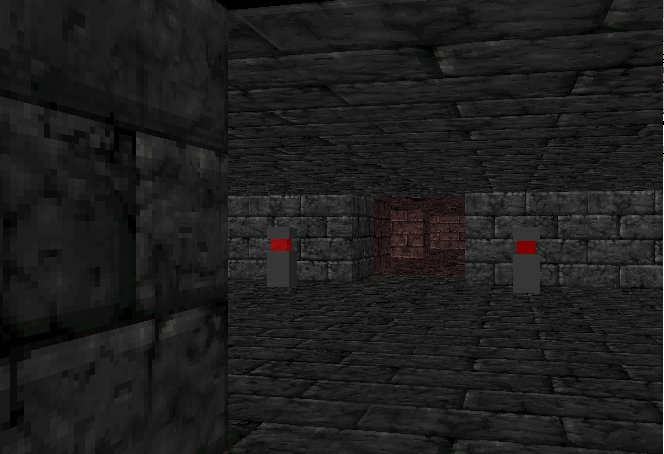



## Dugeon3D

### Description

An example about how build a 3D Dugeon using DX7 Direct3DRM and X files.

For other vb games and demos visit my web site: http://web.tiscali.it/fc_vbgames/index.html
 
### More Info
 

             |
---                |---
**Submitted On**   |2002-01-15 12:44:42
**By**             |[fabio calvi](https://github.com/Planet-Source-Code/PSCIndex/blob/master/ByAuthor/fabio-calvi.md)
**Level**          |Advanced
**User Rating**    |4.2 (21 globes from 5 users)
**Compatibility**  |VB 5\.0, VB 6\.0
**Category**       |[DirectX](https://github.com/Planet-Source-Code/PSCIndex/blob/master/ByCategory/directx__1-44.md)
**World**          |[Visual Basic](https://github.com/Planet-Source-Code/PSCIndex/blob/master/ByWorld/visual-basic.md)
**Archive File**   |[Dugeon3D487781152002\.zip](https://github.com/Planet-Source-Code/fabio-calvi-dugeon3d__1-30815/archive/master.zip)

